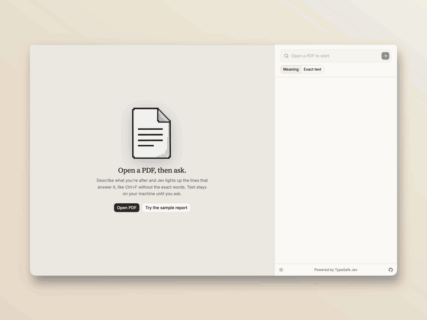

<p align="center">
  
</p>

<h1 align="center">JevPDF</h1>

<p align="center">
  <b>Ctrl+F for when you don't know the exact words.</b><br>
  Ask a PDF in your own words and watch the matching lines light up.
</p>

<p align="center">
  <a href="https://jevpdf.fly.dev"></a>
</p>

<p align="center">
  
  
  
  
  
  
</p>

<p align="center">
  <a href="#run">Run</a> ·
  <a href="#using-it">Using it</a> ·
  <a href="#how-it-works">How it works</a> ·
  <a href="#deploy-flyio">Deploy</a>
</p>

<p align="center">
  <a href=".github/demo.mp4"></a><br>
  <sub>▶ <a href=".github/demo.mp4">Watch the full-quality video</a></sub>
</p>

## Powered by Jev

JevPDF is built on **[Jev](https://docs.typesafe.ai)**, [TypeSafe](https://typesafe.ai)'s flagship System One model. Jev doesn't write prose. It answers typed questions with structured values your code can use directly, and that's exactly what search needs.

- **A yes/no for every line.** Each line of the PDF becomes one [noul](https://docs.typesafe.ai/primitives): *does this line answer the query?* Jev returns a probability from 0 to 1. The app ranks by that number, so there's no prompt parsing and no answer text to hallucinate.
- **Many questions in one pass.** Jev scores all the questions in a request in parallel, each on its own, against the same shared page text. Adding questions barely changes response time, so JevPDF sends 16 lines per request and keeps 16 requests in flight. Highlights stream in page by page.
- **Cheap enough to ask about every line.** Jev costs $0.042 per million input tokens, and output is free. Checking every line of a 15-page paper costs well under a cent.
- **Nothing to build first.** No embeddings, no vector index, no chunking strategy. Extract the text once, then keep asking.

## Run

```sh
bun install
cp .env.example .env.local   # add TYPESAFE_API_KEY
bun run dev                  # http://localhost:5173
```

Click **Try the sample report** and ask one of the suggested questions.

## Using it

- **Meaning** (default): type a question and press Enter. Matches light up as Jev answers. Press Enter again for the next match, Shift+Enter for the previous one.
- **Exact text**: matches update as you type.
- `/` or ⌘F focuses search. Esc stops a search or clears the box. Click a highlight on the page to select it.
- If nothing clears the threshold, the closest lines are shown instead.

## How it works

1. **Extract (local).** pdf.js reads each page's text runs and groups them into lines with rects (`src/lib/extract.ts`). The result is cached in IndexedDB by the file's SHA-256. Page numbers are 1-based on the original PDF.
2. **Exact text.** Local, case- and whitespace-insensitive match that can cross line breaks, with character-level rects (`src/lib/exact.ts`).
3. **Meaning.** Each line gets one Jev noul question: "does this line answer the query?" (`src/lib/jev.ts`). A batch shares one state (the query plus the page text as context) and asks up to 16 self-contained questions, each carrying its own line text. Highlights paint as batches return. Lines at or above `HIT_THRESHOLD` are hits, ranked by noul. Nouls are cached per file hash and query.
4. Jev only receives text, never PDF bytes.

All thresholds, budgets, and the question wording live in `src/lib/jev-config.ts`.

## Jev rules followed

- Text-only state; one narrow noul per span.
- Requests are checked against the 64k / 32k (state + longest question) token limits.
- A running search is cancelled when the query or mode changes.
- Exponential backoff with jitter on 429/529/5xx, honouring `Retry-After`.
- The API key stays on the server: `/api/jev` is a Vite middleware (`server/typesafe-proxy.ts`, for both `dev` and `preview`) that adds the Bearer header. `.env.local` is gitignored.

## Deploy (Fly.io)

`server/index.ts` is a small Bun server that serves `dist/` and the `/api/jev` proxy, which uses the same forwarding code as dev (`server/jev-upstream.ts`). Because the live proxy spends real credits, it only accepts same-origin POSTs from the app, pins the model, caps request size, and rate-limits each IP.

```sh
fly secrets import < .env.local   # TYPESAFE_API_KEY
fly deploy
```

## Sample

`public/sample/tallwood-annual-report-2025.pdf` is a fictional four-page annual report, regenerated with `bun scripts/make-sample.ts`. Its wording deliberately avoids the demo queries' exact phrasing.
